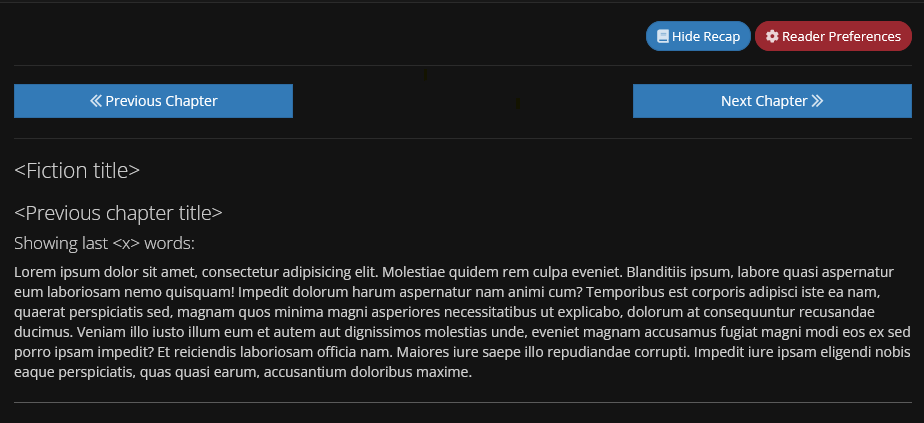

# RoyalRecap

A web extension for [royalroad.com](https://royalroad.com). For people who juggle multiple stories.

## Why?

I've been an avid reader on [royalroad.com](https://royalroad.com) for over 4 years and like many others, I juggle
multiple stories at the same time. At some point this got somewhat unmanagable and often I drew a blank when thinking
about what happened in the last chapter of the story I just opened. More and more I found myself having to go back one
chapter and scroll all the way down just to re-read the last few paragraphs as a refresher. This is especially annoying
while on mobile, where I often read while on the train, and lenghty chapters.

That's when decided on trying to implement this little idea of a small recap function, or if that was not possible, at
least a way to stop navigating to the previous chapter every time.

## What is it?

RoyalRecap is a browser extension ([only for Firefox at the moment](https://github.com/Seismix/RoyalRecap/issues/5))
that inserts a button next to RoyalRoad's "Reader Preferences" button. When clicked, the last few paragraphs of the
previous chapter get fetched and displayed at the top of the chapter, which you can toggle on and off using the button.
The extension defaults to showing you the last 250 words of the previous chapter, but you will be able to tune this to
your liking (see [TODOs](#todos), and [#3](https://github.com/Seismix/royalrecap/issues/3)).

Here's an example of what it looks like:

|  |
| ------------------------------------------ |
| _Ads removed for demonstration purposes_   |

## TODOs

This extension is still a work in progress so there's plenty left to accomplish. If you have a good idea, you can create
a new issue to describe it/contribute and I will consider it. Here's a few examples of what I have planned:

- [x] [#3](https://github.com/Seismix/royalrecap/issues/3): ~~A settings page for various current and also future settings~~
- [ ] [#5](https://github.com/Seismix/royalrecap/issues/5): Cross browser compatibility
- [x] [#6](https://github.com/Seismix/royalrecap/issues/6): Prettier recap text (with formatting)

Check out everything I'm tracking in this project's [issues](https://github.com/Seismix/royalrecap/issues/)

## Contributing and bug reports

This is my first public repo, so I can't rely on pre-existing knowledge. For now and until changes are needed, just create
a issue with an appropriate label and a descriptive message and I will take a look.
