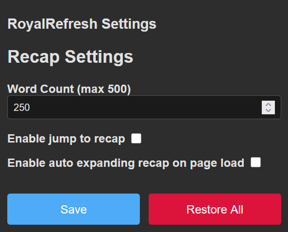

# RoyalRefresh

A web extension for [royalroad.com](https://royalroad.com). For people who juggle multiple stories.

## Why?

I've been an avid reader on [royalroad.com](https://royalroad.com) for over 4 years and like many others, I juggle
multiple stories at the same time. At some point this got somewhat unmanagable and often I drew a blank when thinking
about what happened in the last chapter of the story I just opened. More and more I found myself having to go back one
chapter and scroll all the way down just to re-read the last few paragraphs as a refresher. This is especially annoying
while on mobile, where I often read while on the train.

That's when decided on trying to implement this little idea implementing a refresh of what happened in the last chapter.

## What is it?

RoyalRefresh is a browser extension for [royalroad.com](https://royalroad.com)
that inserts a button next to RoyalRoad's "Reader Preferences" button. When clicked, the last few paragraphs of the
previous chapter get fetched and displayed at the top of the chapter, which you can toggle on and off using the button.
The extension defaults to showing you the last 250 words of the previous chapter (adjustable in extension settings,
[see Settings](#settings)).

Here's an example of what it looks like:


## Settings

The extension comes with a settings page where you can adjust the refresh length and other settings.
There are a few ways to access the settings page:

1. Click the extension icon in the browser toolbar to open the popup (Recommended)
1. Open RoyalRoad's "Reader Preferences" menu and click "Open RoyalRefresh settings"
1. Depending on your browser, there may be alternative methods to access the extension settings,
(such as using `about:addons` in Firefox)

The settings page looks like this:



Advanced users can take advanced of the "Advanced options" toggle to reveal more settings. In case the website gets an
update, the user can adjust the CSS selectors to make the extension work again, until a new update of RoyalRefresh is
released with the adjusted defaults:


## Bug reports & Ideas

Check out everything I'm tracking in this project's [issues](https://github.com/Seismix/royalrefresh/issues/).

This is my first public repo, for now and until changes are needed, just create a issue with an appropriate label and a
descriptive message and I will take a look. Any contributions are welcome, issues where I specifically need help are
marked with the `contributions welcome` label.

## Contributing

Pull this repo and run `pnpm i` to install the dependencies. You can then run `pnpm dev` or `pnpm dev:chrome`
to temporarily load the extension into your browser. The extension will be reloaded automatically when you make changes
to [most](https://github.com/aklinker1/vite-plugin-web-extension/issues) of the code.

You can pass custom `web-ext` arguments to the `pnpm dev` command by creating a `.webextrc.(json|json5|yml|yaml)` file
in the root of the project. For more information, see Vite Plugin Web Extension's
[documentation](https://vite-plugin-web-extension.aklinker1.io/guide/configure-browser-startup.html#config-files).

For example to always start the dev browser on certain URLs, you can create a `.webextrc.json` file with the
following content:

```json
{
  "startUrl": [
    "https://www.royalroad.com/",
    "about:addons"
  ]
}
```

For a full list of arguments, see the `web-ext`
[command reference](https://extensionworkshop.com/documentation/develop/web-ext-command-reference/).
